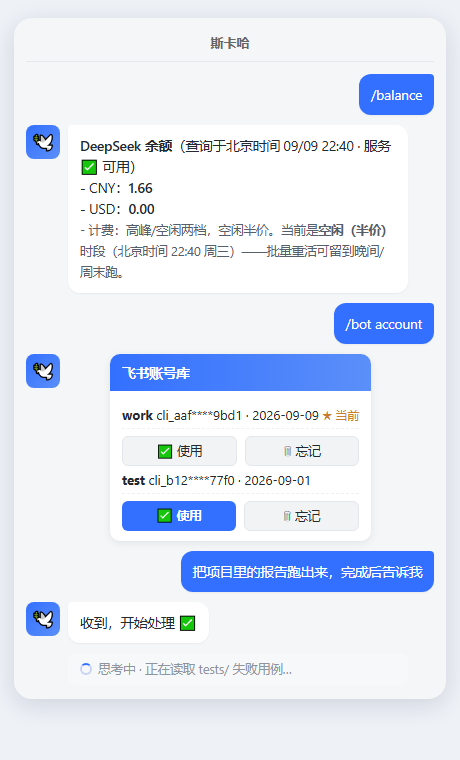
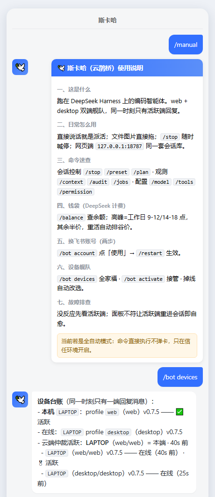

<p align="center">
  <a href="https://github.com/moyu-good/dsh-lark-bridge/actions/workflows/ci.yml"></a>
  
  <a href="https://dshbase.com/zh/plugins/moyu-good-dsh-lark-bridge/"></a>
  
  
  
</p>

<h1 align="center">🕊️ dsh-lark-bridge</h1>

<p align="center">
  <b>把 DeepSeek Harness 的编码智能搬进飞书</b><br/>
  <i>原生思考过程 · 审批卡片 · web/desktop/CLI 三端舰队同步 · 账号一键切换 · 余额与峰谷计价感知——不需要公网回调地址。</i>
</p>

<p align="center">
  <a href="README.md">English</a> ·
  <a href="#-60-秒上手">快速开始</a> ·
  <a href="#-像用户一样用它">用户指南</a> ·
  <a href="#-能力">能力</a> ·
  <a href="#-faq">FAQ</a>
</p>

---

## 🖼️ 先睹为快

<p align="center">
  <a href="docs/assets/shot1.png"></a>
  <a href="docs/assets/shot2.png"></a>
</p>
<p align="center">
  <sub>示意图（飞书聊天样式）：左边是 <code>/balance</code> 余额＋峰谷档、<code>/bot account</code> 账号库卡片（点「使用」即切换）、任务确认与思考中状态；右边是 <code>/manual</code> 全量使用说明与 <code>/bot devices</code> 设备舰队台账。</sub>
</p>

## 🤔 这是什么？

`dsh-lark-bridge` 是一个 **飞书/Lark 即时通讯机器人通道**，让 DeepSeek Harness 的编码代理直接在聊天里工作。每个聊天（私聊/群聊）驱动一个独立的 dsh agent，桌面版能看到的过程，聊天里全部可见——而且**飞书、网页端、桌面端共享同一套会话库，三端接力干活**：

- 🧠 **思考过程实时可见** —— 飞书原生「思考中」消息渲染 reasoning，工具调用带图标、结果代码块展示，不黑盒
- 🌐 **三端舰队同步** —— web（浏览器）/ desktop（DSH Desktop）/ CLI 同一套 `~/.dsh` 会话库；云端仲裁保证**同一时刻只有一端回复**，活跃端掉线自动改选
- 🔄 **账号一键切换** —— `/bot account` 弹出账号库卡片，点「使用」两下完成换飞书应用，凭证共享同步
- 💰 **余额与峰谷计价感知** —— `/balance` 查 DeepSeek 余额（带查询时刻）；提示词内置峰/谷时段表，批量重活自动排进半价时段
- ✅ **审批卡片＋决策人留痕** —— 需要确认的操作变成可点击卡片，谁批的写得清清楚楚
- 🔌 **WebSocket 长连接** —— 不需要公网回调地址，不需要反向代理
- 📖 **`/manual` 随取随用** —— 八节完整使用说明直接在聊天里发给你

本质是「嫁接」：飞书只是载体，真正干活的还是 DeepSeek Harness 本体。

## 🚀 60 秒上手

**准备**：Node 18+、[pnpm](https://pnpm.io/installation)（推荐）、一个 DeepSeek API Key、手机上有飞书。

```sh
# 1. 把插件装进 dsh profile 并启动（pnpm —— 并行安装，实测约 20 秒）
pnpm dlx @deepseek-ai/dsh plugin --profile web add @moyu-good/dsh-lark-bridge \
  && pnpm dlx @deepseek-ai/dsh web

# 2. 控制台打印二维码 → 用飞书扫码
#    （自动创建应用＋事件订阅，凭据持久化）

# 3. 打开 dsh 控制台 → Settings → Models → 填入 DeepSeek API Key

# 4. 私聊机器人，或群里 @ 它。完成。
```

> [!TIP]
> 新人不知道机器人会什么？对它发 **`/manual`**——八节完整使用说明直接发到聊天里；
> 发 `/help` 看全部命令。你唯一要学的动作就是「直接说话派活」。

> [!NOTE]
> **首次 `plugin add` 会失败一次**，报
> `ERR_PNPM_IGNORED_BUILDS ... protobufjs`——pnpm 11 默认拦截 `protobufjs`
> （飞书 SDK 的依赖）的 postinstall，而该脚本只是无害提示。打开
> `<你的home>/.dsh/profiles/web/pnpm-workspace.yaml`，把占位行改成
> `protobufjs: true`，再重跑同一条命令即可。每个 profile 仅需一次。

## 💬 像用户一样用它

- **直接说话派活**：「帮我看看这个项目为什么测试挂了」——文件、图片直接拖进聊天。
- **三端接力**：浏览器开 `http://127.0.0.1:18787`（web 形态与飞书端同库）；DSH Desktop 装了桥插件后同样入列。同一时刻活跃端回复，其它端待命，`/bot devices` 随时看舰队。
- **换飞书应用两步**：`/bot account` → 点卡片「✅使用」→ `/restart` 生效。
- **新手引导自动化**：新会话首条消息自带简短引导；`/manual` 取完整说明；`/balance` 看钱袋。

完整手册（八节，含故障排查）：[`docs/用户手册.md`](docs/用户手册.md)。

## ✨ 能力

亮点——别的桥没有的：

| | |
|---|---|
| 🧠 **原生飞书 CoT** | reasoning 渲染为平台原生「思考中」消息；旧客户端退化为打字机卡片 |
| 🌐 **三端舰队同步** | web/desktop/CLI 同一套会话库；端级云端仲裁（`deviceId:form:profile`）——同机双端不会双回复，活跃端掉线自动竞选接管 |
| 🔄 **账号库交互卡片** | `/bot account` 存/切/忘多个飞书应用凭证，卡片两下切换；共享设置全端生效 |
| 💰 **余额与峰谷感知** | `/balance` 实时查 DeepSeek 余额（分币种、带查询时刻）；提示词内置峰谷时段表，重活自动排半价时段 |
| 📋 **审批卡片＋决策人留痕** | 点击即决策，谁批的写得清清楚楚 |
| 🎯 **goal/todo 实时卡＋自动续跑** | 阶段变化实时进聊天；`autoResumeGoals` 重启后自动恢复 |
| 🛠️ **飞书原生 agent 工具** | `feishu_notify` 主动发消息、`feishu_drive_*` 用应用云盘当跨设备便签 |
| 🔍 **会话历史检索** | `/sessions <关键词>` 对本聊天历史全文搜索 |
| 🖥️ **面板自愈** | 命令面板由活跃端单写者维护，双语、与实际能力对齐；待命端不抢写 |
| 🌐 **双语斜杠面板** | 国际版 Lark 英文、国内版飞书中文，自动切换 |

<details>
<summary><b>全部能力</b></summary>

| | |
|---|---|
| 🗂️ 一会话一 Agent | `sessionScope`：整个 chat / 话题 thread / 单 sender；会话持久化，重启恢复 |
| ✅ Live Reaction | 收到 `OK` → 思考 `THINKING` → 完成 `DONE`（失败 `ERROR`），状态互替可配置 |
| 📦 压缩透明化 | 「正在压缩…」→ 摘要＋释放 token 数；修剪报告删除条数 |
| 🧑💻 子代理 fan-out | workflow 以文本流呈现：run 开始、子代理开启/结束、run 结束 |
| ⏰ 定时提醒 | `/schedules` 视图（模型侧工具需组合 `@deepseek-ai/dsh-schedule`） |
| ⚙️ 后台任务通知 | `run_in_background` 任务与子代理结束时播报结果 |
| 🧩 Skill 生态面板 | `/skills` 列出可用 skills，`/skills <name>` 看详情 |
| 🤖 模型切换 | `/model <provider>/<model>` 走宿主 `saveSelection`，持久生效 |
| 💵 余额查询 | `/balance` 实时查 DeepSeek 开放平台余额（分币种/可用性/查询时刻） |
| 🖥️ PC 能力补齐 | 组合 `dsh-terminal*` / `code-runtime-worker-thread` / `dsh-mcp-client` → PTY 终端、Code Mode、外部 MCP |
| 🗺️ 工作区可见 | `/ws` 列出已注册工作区并标记新会话落点 |
| 🖼️ 图片输入（可选） | `attachImages` 把聊天图片传给模型 |
| 📎 文件发送 | Agent 的 `send_file` 带 caption 投递到聊天（本地目录默认拒绝） |
| 🔑 扫码注册 | 首次启动打印二维码，扫码即建应用 |
| 🔒 授权窄化 | `senderAllowlist` / `groupAllowlist` / `approvers` |
| 🧩 驿传钩子 | `chronicleEndpoint`：每条入站消息 fire-and-forget POST 到外部台账 |
| 🛡️ 深度 dsh 适配 | 全部走宿主服务契约，包自包含，无需宿主源码 |

</details>

### 与其他飞书/Lark 桥对比

> **核查基准**：2026-09-09 逐家公开 README 复核（仓库链接见「生态与收录」）。
> 「未见」= 公开文档未见该能力，非绝对不存在；各家定位不同——dsh-im 是 8+ 渠道的
> 多平台网关，广度是它的主场；本桥押的是单平台深度与多端舰队。

| 能力 | **dsh-lark-bridge** | xmanrui/dsh-im | omdsh-dev/dsh-lark | AX1202/ax-feishu-bridge |
|---|---|---|---|---|
| 定位 | 飞书单平台深修 + 多端舰队 | 多平台网关（飞书/钉钉/企微/WhatsApp/Discord/QQ 等） | 飞书深修，多 agent 群协作 | 飞书 × Pi agent |
| 思考呈现 | 飞书原生「思考中」消息 | 流式卡片（思考/工具进度） | 原生（需 PC 7.70+/移动 7.74+） | 卡片流式输出 |
| 审批 | 卡片 + 决策人回写留痕 | 文本回复（批准/拒绝） | 卡片 + 决定人解析 | 未见公开说明 |
| 实时 goal/todo 卡片 | ✅ | 未见 | 未见 | 未见 |
| 压缩透明化 | ✅（进度 + 释放 token 数） | `/compact` 命令 | `/compact`（宿主命令直通） | 未见 |
| 多端舰队 + 端级仲裁 | ✅ 三端同库接力、掉线自动改选 | 私聊文本双向同步（手动开启） | — | — |
| 账号库交互切换 | ✅ 卡片两下，全端生效 | — | — | — |
| 余额查询 + 峰谷计价感知 | ✅ | — | — | — |
| 斜杠面板 | 双语注册 + 活跃端单写者自愈 | 原生面板（`/repair` 补权限） | 宿主命令直通 | 未见 |

## 💬 斜杠命令

| 命令 | 说明 |
|---|---|
| `/stop` | 取消当前任务 |
| `/help` | 显示本列表 |
| `/manual` | 完整使用说明（新人从这里开始） |
| `/balance` | 查 DeepSeek 余额（含当前峰谷档） |
| `/preset` | 查看/切换 agent 模式（standard / code / minimal / cordis） |
| `/permission` | 查看/切换权限模式（宿主） |
| `/goal` | 查看/设置目标（宿主） |
| `/plan` | 进入/退出计划模式（宿主） |
| `/compact` | 压缩较早对话历史（宿主） |
| `/sessions` | 本聊天会话历史检索 |
| `/tools` | 运行时查看/禁用/恢复工具 |
| `/skills` | 查看 skills / 某个 skill 详情 |
| `/model` | 查看/切换默认模型 |
| `/ws` | 查看已注册工作区 |
| `/jobs` | 本会话后台任务 |
| `/schedules` | 本聊天定时提醒 |
| `/context` | 当前上下文 token 压力 |
| `/audit` | 本会话操作审计摘要 |
| `/config` | 桥的当前配置 |
| `/feedback` | 给上一条回答评分 |

**`/bot` 子命令**（桥管理）：`set` / `unset` / `peers` / `sync-plugins` / **`account`**（save·use·forget，交互卡片）/ `export` / `import` / `devices` / `retire` / `activate` / `name`。

面板描述按平台自动双语；`locale: zh|en` 可强制指定。面板由活跃端单写者维护，与实际能力对齐。

## 📦 换机迁移

桥自带迁移路径——旧机上：

```text
/bot export include-secrets --to-feishu   # 直传应用自己的飞书云空间
/bot export include-secrets               # 或本地文件，凭证掩码
```

飞书路线零拷贝：文件落在应用自己的云空间（仅本应用可见），新机直接
`/bot import --from-feishu` 拉取。本地文件路线则把打印出的文件（sync 目录，
如 `~/.dsh/dsh-lark-bridge/migrate.json`）拷到新机同路径，按 Quick Start 装
好插件后：

```text
/bot import                       # 预览：将写入的设置 + 装包计划 + 提醒
/bot import apply                 # 执行（云端槽位加 --from-feishu）
```

带得走的：共享设置与各 profile 插件清单（经上游 CLI 重装，跨平台直接可用）。
永不带走的：peer 心跳、control token、`node_modules`、会话历史——会话在
`~/.dsh`（上游管理），整目录拷贝即可带走。

**设备生命周期**：每台机器首启生成稳定 `deviceId`（`/bot devices` 查看台账：
本机、心跳在线端、云端活跃端、迁移档案）。旧机不用手动停——`/bot retire`
即退位（后续消息只回一行提示、不再驱动 agent；该标记是本机私有状态，永不
同步），`/bot activate` 重新启用——云端通道可用时同时认领活跃槽位，其它
端在下一条消息自动退避。每台在线端每分钟向云端台账续写心跳；活跃端
掉线超时后，端键最小的新鲜端在下一条消息自动当选接管。
`/bot name <可读名>` 给设备起台账显示名。

## ⚙️ 配置速查

| 字段 | 默认 | 含义 |
|---|---|---|
| `appId`、`appSecret` | 首次扫码注册 | 飞书/Lark 应用凭证（可 `/bot set` 进共享设置全端生效） |
| `cwd` | 宿主进程 cwd | 会话 Agent 的工作目录 |
| `provider`、`model` | 宿主默认 | 会话 Agent 的模型路由 |
| `output` | `cot` | 原生思考消息 vs 打字机卡片 |
| `requireMention` | `true` | 群聊仅被 @ 时响应 |
| `outbound.allowedFileDirs` | 未配置=禁用 | `send_file` 允许读取的本地目录 |
| `chronicleEndpoint` | `''` | 可选的外部全文台账钩子 |

完整字段说明见 [English README Configuration](README.md#️-configuration)。凭据三层解析（后者覆盖前者）：bundle patch 配置 → settings 文档插件区 → 首次扫码注册。

<details>
<summary><b>应用必需权限（手动建应用时）</b></summary>

| 权限 | 用途 |
|---|---|
| `application:app_slash_command`（read + write） | 斜杠面板——缺它同步报 `99991672` |
| `im:message` / `im:message:readonly` | 发送/读取消息 |
| `im:message.receive_v1` 事件 | 接收消息（事件与回调 → 长连接） |
| `im:resource` | 上传图片和文件 |
| `im:chat:read` | 群信息 |
| `im:message.reactions:read` / `write_only` | reaction 反馈 |
| `drive:drive`（或云空间读写） | `/bot export --to-feishu`、`feishu_drive_*` 工具、云端仲裁 |

扫码注册自动授予；手动创建的应用加完权限必须**发布新版本**。面板同步在会话 create/resume 时触发——开通后给 bot 发条消息即可。

</details>

## 🧭 架构

```
飞书 / Lark ── WebSocket 长连接 ──►  dsh-lark-bridge（dsh 进程内的 feishu-channel 插件）
   (聊天/审批/图片)                       │  host 服务契约:
                                          │  agents / sessions / tools /
                                          ▼  approval / goal / settings
                                    DeepSeek Harness 本体
   web(浏览器) ─┐
   desktop     ─┼── 同一套 ~/.dsh 会话库 + 共享设置 + 云端仲裁（端级 deviceId:form:profile）
   CLI         ─┘
```

任意启动器均可托管（shell / systemd / supervisor），不依赖任何其他 agent 框架。

## 🧩 围绕它做开发

三条不变式让这个仓库长期可维护：

1. **嫁接桥，不重集成** —— 桥只做消息归一化；一切能力来自官方 opt-in 的 dsh 插件家族，
   在你的 profile 里组合即可。桥零改动 = 上游发新功能零升级成本。
2. **一切走宿主服务契约** —— `agents` / `agentPresets` / `approval` / `goals` / `settings`…，
   只依赖已发布的包，自包含。
3. **凡改动先立设计卡** —— 见 [`docs/design/`](docs/design/README.md)；实现完回填变更记录，
   被阻塞的调研也归档为资产。

**仓库地图**

```
src/
  bridge.ts          消息管线：归一化 → 鉴权 → 确认 → agent 回合 → 渲染
  commands.ts        slash 命令（中英双语 i18n）
  cot.ts outbound.ts 思考过程与答案渲染
  feishu-tools.ts    飞书原生 agent 工具（发消息/云盘读写列）
  sync/              双端同步：设置单源/心跳/control API/迁移/账号库/端级仲裁
  pricing.ts         DeepSeek 峰谷计价实时判定
  user-guide.ts      /manual 的单一内容源
  chronicle.ts       外部台账入驿钩子（集成扩展示例）
  config.ts          schema 与默认值
tests/               vitest 套件（397 个），含 harness 注入式假件
scripts/             verify-dsh-contract.mjs —— 对上游 master 的漂移校验
plugin-contract-test.mjs     43 条宿主契约断言
```

**质量门**

```sh
pnpm test                        # 397 单测/集成
node plugin-contract-test.mjs    # 43 条契约断言
node scripts/verify-dsh-contract.mjs   # 对上游 master 的漂移检查
pnpm typecheck && pnpm run build # tsc + tsdown（lib/ 已提交）
```

CI 每次 push / PR 都跑全套，其中漂移检查钉在上游 dsh master——上游改了契约，构建会在用户之前告诉你。

**想加功能？** 先写设计卡（模板在 `docs/design/`），再实现、再回填。如果需求只是「看到消息」，
优先用 `chronicleEndpoint` 钩子而不是改管线——参考 `src/chronicle.ts`。

## 🧱 开发与 MR 流程

`main` 是稳定基线，**只接受经过评审的 merge request**。所有开发都在特性分支（`feat/<名称>`）上进行，不直接提到 `main`。

每个 MR 的清单：
1. 从 `main` 开分支；改动要小、只做一件事。
2. 全量质量门全绿（`pnpm hygiene`、`pnpm test`、`node plugin-contract-test.mjs`、`node scripts/verify-dsh-contract.mjs`、`pnpm typecheck && pnpm build`）。
3. 仓库卫生扫描 —— `pnpm hygiene` —— 必须 exit 0。部署专有词写在本机 `.leak-patterns`（模板见 `.leak-patterns.example`），**绝不进仓库**。
4. 评审通过 → 合入 `main` → 从 `main` 部署。
5. 线上事故当场回滚（历史留在 git 里）；被回滚的分支 rebase 后带上修复重新提 MR。

发布就是打标签。推 `v*` 标签会跑与 CI 相同的门禁、校验标签与 `package.json` 一致，并把 CHANGELOG 对应段落发成 release notes —— 所以标签不可能指向一个过不了 CI 的提交。

这条规矩是被逼出来的：过去直接改 `main` 的实验，最后只能作为一个多提交的批量回滚收场 —— 特性分支才能让 `main` 永远可发布。

## 📦 版本与升级策略

双轨制，写明白免得靠猜：

- **预览轨（preview）** — 开发/实验用。跟随上游最新（GitHub releases 含 alpha/rc，或 `master`）和桥的最新能力；这里允许坏。
- **稳定轨（stable）** — 生产部署用。钉 npm `latest` / 最终 rc 线。**生产永不搭载 `alpha`。**

预览轨晋升稳定轨必须过完整质量门禁：
`pnpm test` → `node plugin-contract-test.mjs` → `node scripts/verify-dsh-contract.mjs` → `pnpm typecheck && pnpm run build` → 真链路冒烟。

## ❓ FAQ

<details>
<summary><b>需要公网 IP 或 webhook 吗？</b></summary>
不需要。传输是 WebSocket 长连接；应用需使用长连接事件订阅方式（自建应用）。
</details>

<details>
<summary><b>多台机器/多个端同时连会双回复吗？</b></summary>
不会。云端仲裁按<b>端</b>（deviceId:form:profile）判定，同一时刻只有活跃端回复；活跃端掉线超时后其余端自动竞选接管。同一飞书应用的多条连接会双投递事件，仲裁负责把应答收拢到一端。
</details>

<details>
<summary><b>怎么换绑另一个飞书应用？</b></summary>
<code>/bot account save &lt;名字&gt;</code> 存档当前凭证，之后 <code>/bot account</code> 点卡片「使用」即切换，<code>/restart</code>（web）或重启 Desktop 生效。支持多套凭证并存。
</details>

<details>
<summary><b>支持什么模型？</b></summary>
你的 dsh 部署能路由的都行——桥与模型无关，`/model` 运行时可切。
</details>

<details>
<summary><b>Agent 说发了文件但没收到？</b></summary>
文件发送默认拒绝：先配 <code>outbound.allowedFileDirs</code>。URL 和原始 buffer 始终可用。
</details>

<details>
<summary><b>重启后斜杠面板空了/少了？</b></summary>
启动只注册常量命令；完整面板在会话第一条消息时同步（多端舰队里由<b>活跃端</b>单写，待命端不抢）。给 bot 发句话即可。仍为空就查
<code>application:app_slash_command</code> 权限并发布应用版本。
</details>

<details>
<summary><b>重启会丢什么？</b></summary>
会话从日志恢复；活跃 goal 自动续跑（<code>autoResumeGoals</code>）；权限与模式选择随会话状态保留。
</details>

## 🌍 生态与收录

- [dshbase.com](https://dshbase.com/plugins/moyu-good-dsh-lark-bridge/) —— 已收录且 **verified**
  （headless L3：安装＋加载＋问答实测）· [中文页](https://dshbase.com/zh/plugins/moyu-good-dsh-lark-bridge/)
- [awesome-dsh-plugin](https://github.com/awesome-dsh-plugin/awesome-dsh-plugin/pull/2160) —— 已合并
- [dsh-suite 目录](https://github.com/whyihaveyou/dsh-suite/issues/32) —— 核实通过（orchestration 类）

欢迎 Issue 与 PR——请先立设计卡。

## 📋 已知限制

- 传输级配置（凭证/requireMention/白名单）启动时读取一次，改动需重启；其余配置改 profile 的 `cordis.patch.yml` 后由 Config-only HMR 自动生效（`/config` 可查看当前值）
- 长连接中断期间到达的事件不重放（传输层无游标；出站由 replay 队列兜底）
- `schedule_*` 模型工具需要在 profile 里组合 `@deepseek-ai/dsh-schedule`
- Desktop 宿主（2.0.x 内嵌 harness）暂缺 `hostQuestions` 提供方——提问卡在 desktop 形态降级，web 形态不受影响

## 📄 许可

BSD-3-Clause。架构启发自 [dsh-lark](https://github.com/Roy-oss1/dsh-lark)（同为 BSD-3-Clause）。
